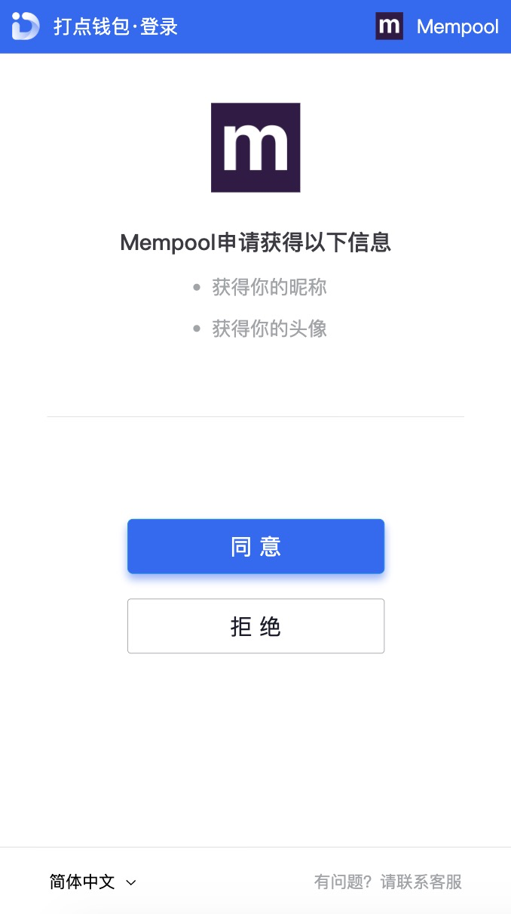

## 用户授权

开发者可通过打点平台授权机制，来获取用户基本信息

1. [第一步：用户同意授权，获取 code](#第一步：用户同意授权，获取-code)

2. [第二步：通过 code 换取网页授权 access_token](#第二步：通过-code-换取网页授权-access_token)

3. [第三步：刷新 access_token（如果需要）](#第三步：刷新-access_token（如果需要）)

4. [第四步：拉取用户信息](#第四步：拉取用户信息)

5. [附：检验授权凭证（access_token）是否有效](#附：检验授权凭证（access_token）是否有效)

### 第一步：用户同意授权，获取 code

首先跳转到打点钱包进行授权应用

> https://www.dotwallet.com/openapi/get_code?app_id=APP_ID&redirect_uri=REDIRECT_URI

返回参数说明

| 参数         | 是否必须 | 说明                       |
| ------------ | -------- | -------------------------- |
| app_id       | 是       | 打点钱包的唯一标识         |
| redirect_uri | 是       | 授权后重定向的回调链接地址 |

下图为跳转到打点钱包的授权页面：



**如果用户同意授权，页面将跳转至 redirect_uri/?code=CODE。**

**如果用户拒绝授权，会返回到商家**

> code 说明 ：code 作为换取 access_token 的票据，每次用户授权带上的 code 将不一样，code 只能使用一次，5 分钟未被使用自动过期。

错误返回码说明如下：

| 返回码 | 说明                              |
| ------ | --------------------------------- |
| 10003  | redirect_uri 域名与后台配置不一致 |

### 第二步：通过 code 换取网页授权 access_token

首先请注意，这里通过 code 换取的是一个特殊的网页授权 access_token。打点钱包可通过下述接口来获取网页授权 access_token。

尤其注意：由于打点钱包的 secret 和获取到的 access_token 安全级别都非常高，必须只保存在服务器，不允许传给客户端。后续刷新 access_token、通过 access_token 获取用户信息等步骤，也必须从服务器发起。

请求方法[`POST`]

> 获取 code 后，请求以下链接获取 access_token：
> https://www.dotwallet.com/openapi/access_token

| 参数   | 是否必须 | 说明               |
| ------ | -------- | ------------------ |
| app_id | 是       | 打点钱包的唯一标识 |
| secret | 是       | 商家私钥           |
| code   | 是       | code               |

正确时返回的 JSON 数据包如下：

```json
{
  "code": 0,
  "msg": "",
  "data": {
    "access_token": "ACCESS_TOKEN",
    "expires_in": 7200,
    "refresh_token": "REFRESH_TOKEN"
  }
}
```

错误时会返回 JSON 数据包如下（示例为 Code 无效错误）:

```json
{
  "code": 10017,
  "data": [],
  "msg": "登录错误，code 无效，错误码:10017"
}
```

返回参数说明

| 参数          | 说明                                          |
| ------------- | --------------------------------------------- |
| access_token  | 接口调用凭证                                  |
| expires_in    | access_token 接口调用凭证超时时间，单位（秒） |
| refresh_token | 用户刷新 access_token                         |

### 第三步：刷新 access_token（如果需要）

由于 access_token 拥有较短的有效期，当 access_token 超时后，可以使用 refresh_token 进行刷新，refresh_token 有效期为 30 天，当 refresh_token 失效之后，需要用户重新授权。

请求方法[`POST`]

> https://www.dotwallet.com/openapi/refresh_access_token

| 参数          | 是否必须 | 说明                           |
| ------------- | -------- | ------------------------------ |
| app_id        | 是       | 商家 app_id                    |
| refresh_token | 是       | 用来刷新 access_token 的 token |

正确时返回的 JSON 数据包如下：

```json
{
  "code": 0,
  "msg": "",
  "data": {
    "access_token": "ACCESS_TOKEN",
    "expires_in": 7200,
    "refresh_token": "REFRESH_TOKEN"
  }
}
```

错误时会返回 JSON 数据包如下（示例为 code 无效错误）:

```json
{
  "code": 10303,
  "msg": "刷新 access_token 错误，刷新 access token 失败，错误码:10303",
  "data": []
}
```

返回参数说明

| 参数          | 说明                                          |
| ------------- | --------------------------------------------- |
| access_token  | 接口调用凭证                                  |
| expires_in    | access_token 接口调用凭证超时时间，单位（秒） |
| refresh_token | 用户刷新 access_token                         |

### 第四步：拉取用户信息

开发者可以通过 access_token 拉取用户信息了。

请求方法[`GET`]

> https://www.dotwallet.com/openapi/get_user_info?access_token=ACCESS_TOKEN

| 参数         | 说明         |
| ------------ | ------------ |
| access_token | 接口调用凭证 |

正确时返回的 JSON 数据包如下：

```json
{
  "code": 0,
  "msg": "",
  "data": {
    "user_open_id": "USER_OPEN_ID",
    "user_name": "USER_NAME",
    "user_avatar": "USER_AVATAR",
    "user_address": "1BNPUQAGjAmW9m8cK3HV4Xp3GZLnW1UZ99",
    "pay_status": 1,
    "pre_amount": 800,
    "total_amount": 12000
  }
}
```

错误时会返回 JSON 数据包如下（示例为 access_token 无效错误）:

```json
{
  "code": 10021,
  "msg": "登录错误，获取用户信息失败，错误码:10021",
  "data": []
}
```

返回参数说明

| 参数         | 说明                             |
| ------------ | -------------------------------- |
| user_open_id | 用户的唯一标识                   |
| user_name    | 用户昵称                         |
| user_avatar  | 用户头像                         |
| user_address | 用户的收款地址                   |
| pay_status   | 是否授权小额支付，0 为否，1 为是 |
| pre_amount   | 小额支付的单笔最大金额           |
| total_amount | 小额支付的累计最大金额           |

### 附：检验授权凭证（access_token）是否有效

请求方法[`GET`]

> https://www.dotwallet.com/openapi/check_access_token/?access_token=ACCESS_TOKEN

| 参数         | 是否必须 | 说明         |
| ------------ | -------- | ------------ |
| access_token | 是       | 接口调用凭证 |

正确时返回的 JSON 数据包如下：

```json
{
  "code": 0,
  "msg": "",
  "data": {
    "status": 1,
    "expire_time": 4010
  }
}
```

错误时会返回 JSON 数据包如下（示例为 access_token 过期错误）:

```json
{
  "code": 10021,
  "msg": "登录错误，获取用户信息失败，错误码:10021",
  "data": []
}
```

返回参数说明

| 参数名      | 说明                                    |
| ----------- | --------------------------------------- |
| code        | 错误码，0 未成功，其他未错误码          |
| status      | 状态，0 为不存在，-1 为已过期，1 为有效 |
| expire_time | 有效剩余时间，单位为秒                  |
