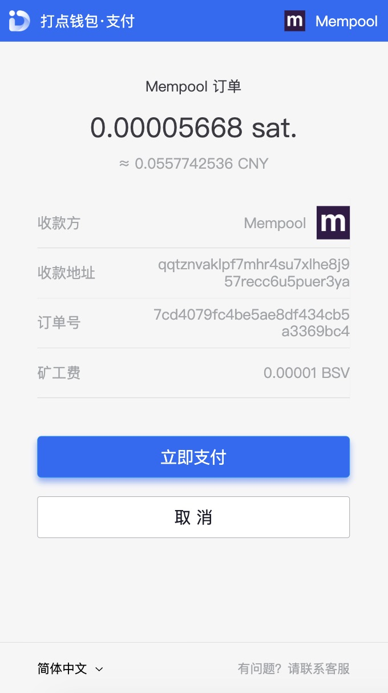
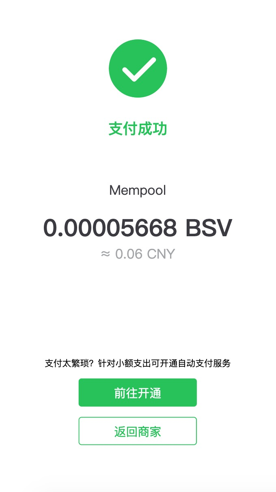

## 提交订单

用户可直接从开发者提交的域名跳转到打点钱包，提交订单:

1. [第一步：商家跳转到打点钱包发起订单请求](#第一步：商家发起订单请求)

2. [第二步：用户跳转到打点钱包完成支付](#第二步：客户端跳转到打点钱包完成支付)

3. [第三步：查询订单状态](#第三步：查询订单状态)

### 第一步：商家发起订单请求

商家拼接 url 跳转到打点钱包发起订单请求

> https://www.dotwallet.com/openapi/apply_order?app_id=APP_ID&merchant_order_sn=MERCHANT_ORDER_SN&order_amount=ORDER_AMOUNT&nonce_str=NONCE_STR&notice_uri=NOTICE_URI&redirect_uri=REDIRECT_URI&item_name=ITEM_NAME&sign=SIGN

传入参数说明

| 参数              | 是否必须 | 类型   | 说明                         |
| ----------------- | -------- | ------ | ---------------------------- |
| app_id            | 是       | int    | 商家 app_id                  |
| merchant_order_sn | 是       | string | 商家订单号                   |
| item_name         | 是       | string | 商家名称                     |
| order_amount      | 是       | int    | 订单金额                     |
| nonce_str         | 是       | string | 随机字串                     |
| sign              | 是       | string | 打点钱包加密签名             |
| notice_uri        | 是       | string | 支付结果服务器通知地址       |
| redirect_uri      | 是       | string | 用户支付完成后的页面跳转地址 |

**sign 生成实例代码(NodeJS)**

```javascript
const md5 = require("md5");
const crypto = require("crypto");

// 将请求的参数传入
function getSignature(queryData) {
  let str = "";
  const secret = md5(Your secret);

  for (let key in queryData) {
    if (key != "sign") {
      if (str) {
        str += "&" + key + "=" + queryData[key];
      } else {
        str = key + "=" + queryData[key];
      }
    }
  }

  str += "&secret=" + secret;
  str = str.toUpperCase();

  const sign = crypto
    .createHmac("sha256", secret)
    .update(str, "utf8")
    .digest("hex");

  return sign;
}
```

正确时返回的 JSON 数据包如下：

```json
{
  "code": 0,
  "msg": "",
  "data": {
    "order_sn": "ORDER_SN"
  }
}
```

错误时会返回 JSON 数据包如下（示例为 merchant_order_sn 重复错误）:

```json
{
  "code": 10107,
  "msg": "订单支付错误，当前订单号已经存在，错误码:10107",
  "data": []
}
```

返回参数说明

| 参数     | 说明             |
| -------- | ---------------- |
| order_sn | 打点钱包的订单号 |

### 第二步：客户端跳转到打点钱包完成支付

成功获取 order_sn 后，客户端跳转到打点钱包进行支付：

> https://www.dotwallet.com/open/pay?order_sn=ORDER_SN

下图为跳转到打点钱包的支付页面：



**如果用户取消订单，会返回到商家**

用户完成支付后可回到商家



### 第三步：查询订单状态

请求方法[`POST`]

> https://www.dotwallet.com/openapi/search_order/

传入参数说明

| 参数              | 是否必须 | 类型   | 说明        |
| ----------------- | -------- | ------ | ----------- |
| app_id            | 是       | int    | 商家 app_id |
| secret            | 是       | string | 商家私钥    |
| merchant_order_sn | 是       | string | 商家订单号  |

正确时返回的 JSON 数据包如下：

```json
{
  "code": 0,
  "msg": "",
  "data": {
    "merchant_order_sn": "m1001",
    "amount": 5668,
    "item_name": "测试下单支付商品",
    "receive_address": "Your BSV address",
    "pay_time": "2019-11-05 17:56:16",
    "order_sn": "1001",
    "status": 0,
    "create_time": "2019-11-05 17:55:16"
  }
}
```

错误时会返回 JSON 数据包如下（示例为 order_sn 不存在情况）:

```json
{
  "code": 10205,
  "msg": "查询订单错误, 订单信息不存在，错误码:10205",
  "data": []
}
```

返回参数说明

| 参数                | 类型     | 说明                                            |
| ------------------- | -------- | ----------------------------------------------- |
| merchant_order_sn   | string   | 商家订单号                                      |
| amount              | int      | 订单金额                                        |
| item_name           | string   | 购买商品名称                                    |
| receive_address     | string   | 商家收款地址                                    |
| user_refund_address | string   | 用户的退款地址                                  |
| pay_time            | datetime | 订单支付时间                                    |
| status              | int      | 订单状态，0 为待支付，9 为已支付，-1 为支付失败 |
| create_time         | datetime | 订单创建时间                                    |

用户返回商家后，会携带以下参数并且跳转到商家

| 参数名              | 类型   | 说明                                                       |
| ------------------- | ------ | ---------------------------------------------------------- |
| app_id              | int    | 商家 app_id                                                |
| order_sn            | string | 打点钱包的订单号                                           |
| merchant_order_sn   | string | 商家订单号                                                 |
| item_name           | string | 购买商品名                                                 |
| receive_address     | string | 收款地址                                                   |
| user_refund_address | string | 用户的退款地址                                             |
| order_amount        | int    | 支付金额                                                   |
| pay_txid            | string | 支付 TXID                                                  |
| status              | int    | 订单状态，0 默认状态，1 支付成功，-1 取消支付，-2 支付失败 |
| nonce_str           | string | 随机字串                                                   |
| sign                | string | 签名                                                       |

打点钱包服务端也会向 `商家提交的 notice_uri`通知商家订单支付结果

| 参数名              | 类型   | 说明                                                       |
| ------------------- | ------ | ---------------------------------------------------------- |
| app_id              | int    | 商家 app_id                                                |
| order_sn            | string | 打点钱包的订单号                                           |
| merchant_order_sn   | string | 商家订单号                                                 |
| item_name           | string | 购买商品名                                                 |
| receive_address     | string | 收款地址                                                   |
| user_refund_address | string | 用户的退款地址                                             |
| order_amount        | int    | 支付金额                                                   |
| pay_txid            | string | 支付 TXID                                                  |
| status              | int    | 订单状态，0 默认状态，1 支付成功，-1 取消支付，-2 支付失败 |
| nonce_str           | string | 随机字串                                                   |
| sign                | string | 签名                                                       |

通知商家订单正确时返回的 JSON 数据包如下：

```json
{
  "code": 0,
  "msg": "Success",
  "data": []
}
```

错误时会返回 JSON 数据包如下:

```json
{
  "code": -1,
  "msg": "fail",
  "data": []
}
```
