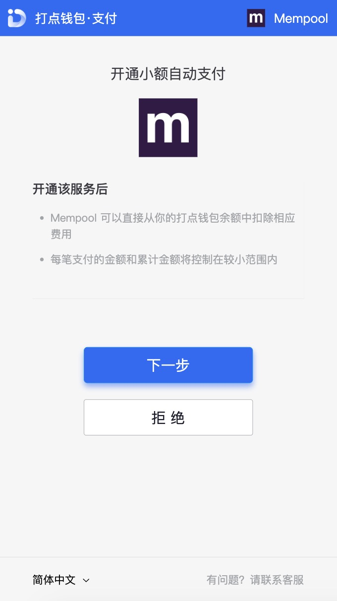
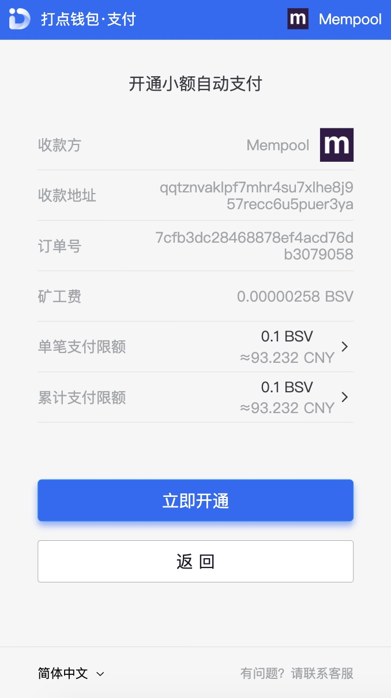

## 小额支付

开发者可通过打点平台授权小额支付机制，来发起小额支付
s

1. [第一步：用户开通小额自动支付服务](#第一步：用户开通小额自动支付服务)

2. [第二步：发起小额支付](#第二步：发起小额支付)

### 第一步：用户开通小额自动支付服务

跳转到打点钱包开通小额自动支付服务

> https://www.dotwallet.com/openapi/set_pay_config?app_id=APP_ID&redirect_uri=REDIRECT_URI

传入参数说明

| 参数         | 是否必须 | 说明                       |
| ------------ | -------- | -------------------------- |
| app_id       | 是       | 打点钱包的唯一标识         |
| redirect_uri | 是       | 授权后重定向的回调链接地址 |

下图为跳转到打点钱包的小额支付页面：



用户点击下一步可自行选择单笔支付限额和累计支付支付限额，默认 0.1BSV

**如果用户返回并且拒绝开提供，会返回到商家的 refuse_url**

下图为用户开通服务页面:



**如果用户开通服务并且成功，页面将跳转至 redirect_uri**

错误返回码说明如下：

| 返回码 | 说明                                            |
| ------ | ----------------------------------------------- |
| 10003  | 小额支付错误，redirect_uri 不合法，错误码:10033 |

### 第二步：发起小额支付

请求方法[`POST`]

> https://www.dotwallet.com/openapi/pay_small_money

传入参数说明

| 参数              | 是否必须 | 类型   | 说明               |
| ----------------- | -------- | ------ | ------------------ |
| app_id            | 是       | int    | 打点钱包的唯一标识 |
| secret            | 是       | string | 商家私钥           |
| merchant_order_sn | 是       | string | 商家订单号         |
| pre_amount        | 是       | int    | 商家要支付的金额   |
| user_open_id      | 是       | string | 用户的唯一标识     |

正确时返回的 JSON 数据包如下：

```json
{
  "code": 0,
  "msg": "",
  "data": {
    "order_sn": "ORDER_SN"
  }
}
```

返回参数说明

| 参数     | 说明             |
| -------- | ---------------- |
| order_sn | 打点钱包的订单号 |

错误时会返回 JSON 数据包如下（示例为 order_sn 重复错误）:

**如果提示用户余额不够，请重新走第一步**

```json
{
  "code": 10039,
  "msg": "小额支付错误，当前订单号已经存在，错误码:10039",
  "data": []
}
```
